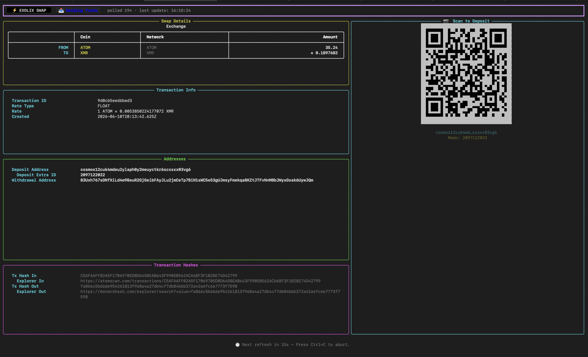

# ⚡ Exolix Swap CLI

A terminal-based crypto swap client for the [Exolix](https://exolix.com) exchange,
built with a live-updating Rich TUI, QR code deposit display, and real-time
transaction polling.


## Screenshot



## Features

- 🔄 **Live TUI** — full-screen terminal interface that refreshes every 15 seconds

- 📷 **QR Code** — scannable deposit address QR rendered directly in the terminal

- 💱 **Float or Fixed rates** — choose your preferred rate type before swapping

- ✅ **Swap preview** — confirm the estimated rate and amounts before committin

- 📊 **Full transaction details** — ID, hashes, addresses, rate, status and more

- 🔁 **Auto-polling** — tracks your swap from `wait` all the way through to `success

- 🔑 **API key via env var** — no need to expose your key on the command line

## Requirements

An Exolix API KEY [register here](https://exolix.com/affiliate#signup) or
 email [support@exolix.com](mailto:support@exolix.com)

Python 3.10+

## Installation

### 1. Clone the repository

`git clone https://github.com/yourusername/exolix-swap-cli.git
cd exolix-swap-cli`

### 2. (Recommended) Create a virtual environment

`python -m venv .venv
source .venv/bin/activate      # Windows: .venv\Scripts\activate`

### 3. Install dependencies

`pip install requests rich qrcode`

## Configuration

Set your Exolix API key as an environment variable so you never have to pass
it on the command line:

```bash
# Linux / macOS
export EXOLIX_API_KEY="your_api_key_here"

# Windows (PowerShell)
$env:EXOLIX_API_KEY="your_api_key_here"

# Persist it in your shell profile (~/.bashrc, ~/.zshrc, etc.)
echo 'export EXOLIX_API_KEY="your_api_key_here"' >> ~/.zshrc
```

Alternatively pass it inline with `--api-key` (see Options below).

---

## Usage

```
python swap.py --coin-from <COIN> --coin-to <COIN> --amount <AMOUNT>
                      --withdrawal-address <ADDRESS> [OPTIONS]
```

### Required arguments

| Argument               | Description                           |
| ---------------------- | ------------------------------------- |
| `--coin-from`          | Coin you are sending (e.g. `BTC`)     |
| `--coin-to`            | Coin you want to receive (e.g. `ETH`) |
| `--amount`             | Amount of the source coin to swap     |
| `--withdrawal-address` | Address to receive the swapped coins  |

### Optional arguments

| Argument                | Default      | Description                                        |
| ----------------------- | ------------ | -------------------------------------------------- |
| `--network-from`        | coin default | Source network override (e.g. `ETH`, `BSC`)        |
| `--network-to`          | coin default | Destination network override                       |
| `--withdrawal-extra-id` | —            | Memo / extra ID for the withdrawal address         |
| `--refund-address`      | —            | Address to return funds to if the swap fails       |
| `--refund-extra-id`     | —            | Memo / extra ID for the refund address             |
| `--rate-type`           | `float`      | `float` (market rate) or `fixed` (guaranteed rate) |
| `--api-key`             | env var      | Exolix API key (fallback if env var is not set)    |

---

## Examples

**BTC → ETH, floating rate:**

```bash
python swap.py \
  --coin-from BTC \
  --coin-to ETH \
  --amount 0.01 \
  --withdrawal-address 0xYourEthereumAddress
```

**ETH → USDT on the ETH network, fixed rate with a refund address:**

```bash
python swap.py \
  --coin-from ETH  --network-from ETH \
  --coin-to   USDT --network-to   ETH \
  --amount 0.5 \
  --withdrawal-address 0xYourUSDTAddress \
  --refund-address     0xYourRefundAddress \
  --rate-type fixed
```

**XMR → BTC, passing the API key inline:**

```bash
python swap.py \
  --api-key   "YOUR_API_KEY" \
  --coin-from XMR \
  --coin-to   BTC \
  --amount    0.64 \
  --withdrawal-address YourBTCAddress
```

---

## How It Works

```
1. Fetch rate    →  GET /api/v2/rate
                    Preview the estimated receive amount before committing.

2. Confirm       →  Interactive y/n prompt in the terminal.

3. Create swap   →  POST /api/v2/transactions
                    Generates a unique deposit address for your swap.

4. Live TUI      →  Full-screen Rich interface displays:
                      • Transaction ID and creation time
                      • From / To coins, networks and amounts
                      • Deposit and withdrawal addresses
                      • Inbound and outbound transaction hashes
                      • Scannable QR code for the deposit address

5. Poll loop     →  GET /api/v2/transactions/{id}  every 15 seconds
                    Status badge updates in real time.

6. Completion    →  TUI shows success (or overdue / refunded) and exits.
```

### Transaction statuses

| Status         | Meaning                                  |
| -------------- | ---------------------------------------- |
| `wait`         | Waiting for your deposit to arrive       |
| `confirmation` | Deposit received, awaiting confirmations |
| `confirmed`    | Deposit confirmed                        |
| `exchanging`   | Swap in progress                         |
| `sending`      | Sending swapped coins to your address    |
| `success`      | ✅ Swap complete                          |
| `overdue`      | Deposit not received in time             |
| `refund`       | Refund in progress                       |
| `refunded`     | Funds returned to refund address         |

---

## Notes

- Exolix requires a **minimum deposit amount** — the preview step shows this
  before you commit.
- For coins that require a **memo / extra ID** (e.g. XRP, XLM, TON) make sure
  to pass `--withdrawal-extra-id` and include it when sending.
- The QR code encodes a standard crypto URI (e.g. `bitcoin:address?amount=...`)
  that is compatible with most mobile wallets.
- Transactions have a time window — if you do not send within that window the
  status will change to `overdue`.

---

## Disclaimer

This tool is a third-party client for the Exolix API. Always verify deposit
addresses independently before sending funds. The authors accept no
responsibility for lost funds caused by incorrect addresses, network issues,
or API changes.

---

## License

MIT © 2024 — see [LICENSE](LICENSE) for details.
